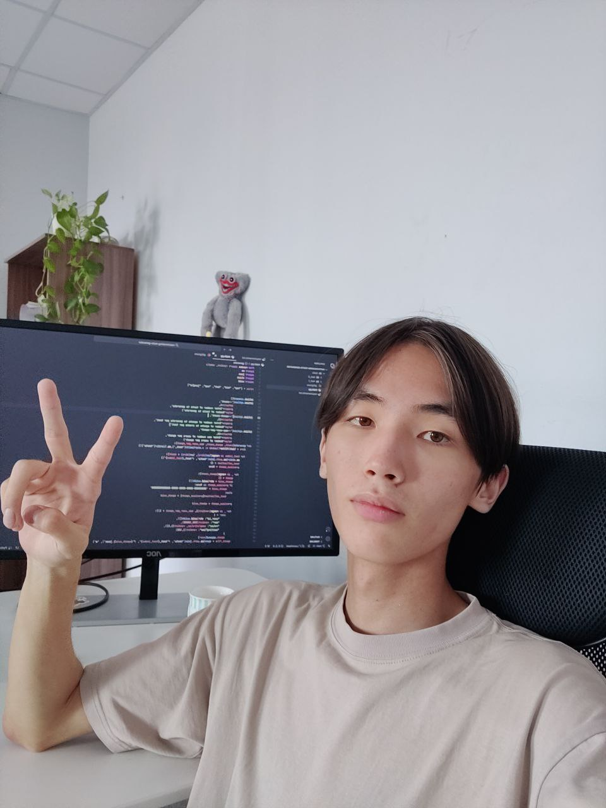

# Сервер для тестинга решений к конкурсу на стипендию Центрального Университета

> Поставьте звёздочку этому репозиторию, буду благодарен)

Этот сервер предназначен для тестирования своих решений к конкурсу на стипендию ЦУ

## Как пользоваться

Легче всего запустить Docker контейер с `docker-compose up -d`, но если у вас установлен Go на компьютере, и вы хотите локально запустить сервер, сначала нужно установить зависимости `go mod download && go mod verify`, затем можете запускать программу `go run .`

После запуска Docker контейнера, запросы на сервер можно отправлять на `localhost:8000`

## Документация

[Открыть документацию](/docs/docs.md)

## Известные проблемы

1. Сервер не следит за пользователями, можно повторно прикреплять одного и того же юзера к нескольким матчам
2. Так как сервер не следит за пользователями, баллы за время ожидания не копятся между эпохами. Если протаскать пользователя до последней эпохи, сервер засчитает время, будто юзера в своей же эпохе распределили
3. Результаты по запросу `/matchmaking/result` нельзя получить по истечению срока Cookie или потере его

Для решения проблемы с отслеживаниями пользователей в базе данных уже есть таблица epoches в стиле linked list, что бы можно было суммировать отрезки времени между эпохами. Просто не успел в коде это применить...

Вы файле `models/db.go` можете заменить базу данных с postgres на sqlite, если хотите способ попроще для тестирования базы данных.

## P.S.

Написание этого сервера было классным опытом, давно так сильно чем-то не увлекался. Спасибо!

## Контакты

Сергин Сергей tg:@etteryand 

